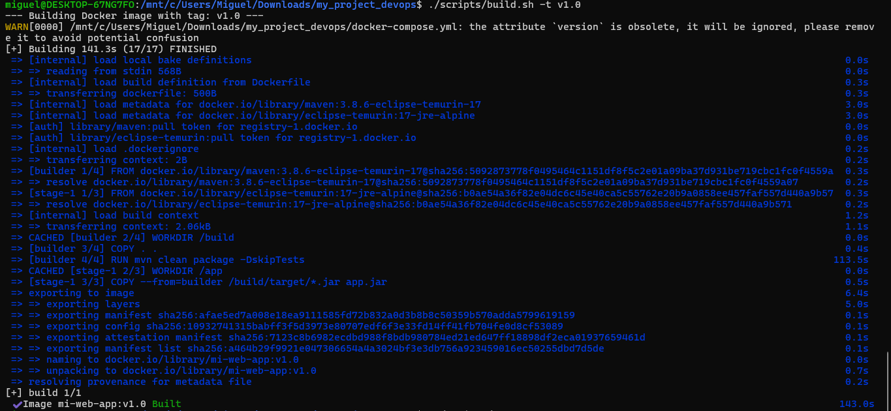
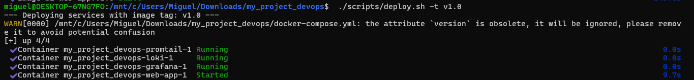
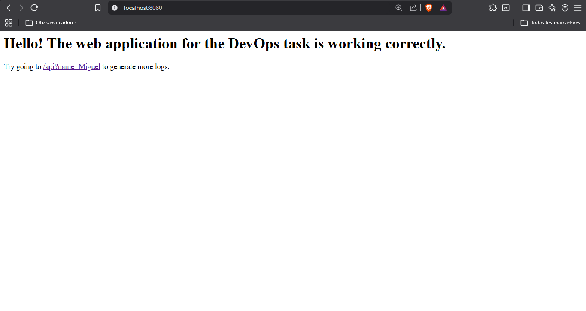
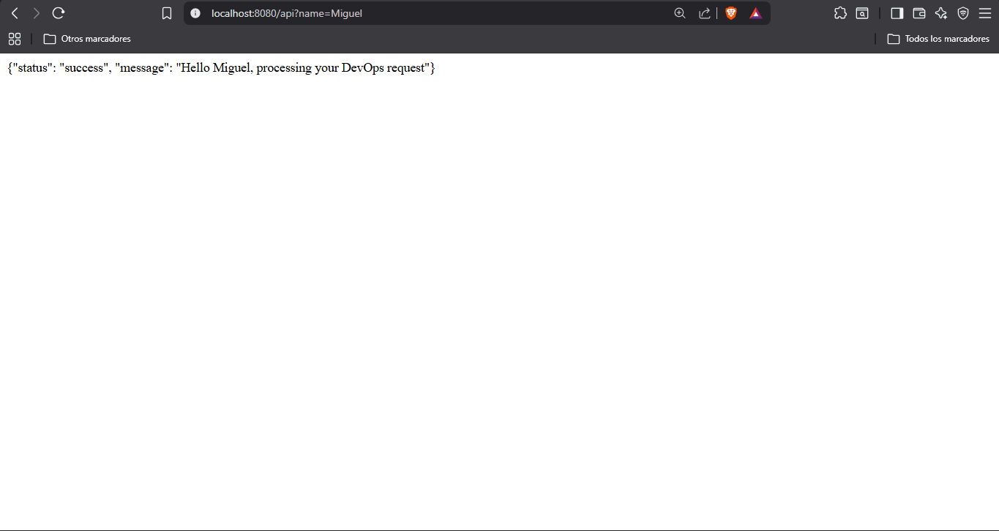
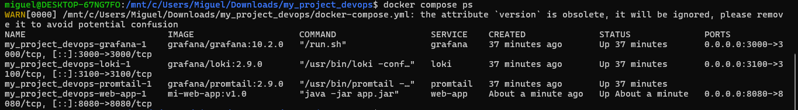
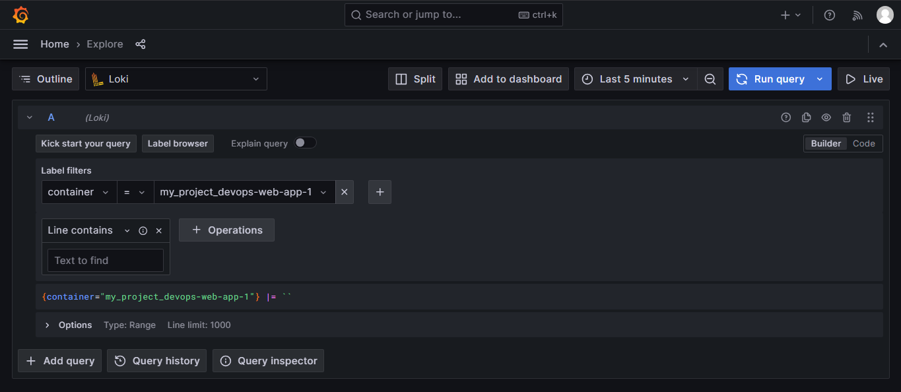

# Итоговая работа: Контейнеризация и централизованное логирование веб-приложения

Данный репозиторий содержит готовую архитектуру для развертывания веб-приложения на Java (Spring Boot) с использованием оптимизированной многоэтапной сборки (**Multistage build**), автоматизации через Bash-скрипты и централизованного сбора логов в связке **Grafana Loki** + **Promtail**.

## 🛠️ Архитектура системы

Вся инфраструктура оркеструется через Docker Compose в единой изолированной сети:

1. **Web App (Spring Boot):** Веб-приложение на Java 17, упакованное через Multistage Dockerfile.
2. **Grafana Loki:** Централизованное хранилище логов, оптимизированное для контейнеров.
3. **Promtail:** Агент, который считывает логи напрямую из Docker демона (`docker.sock`) и отправляет их в Loki.
4. **Grafana:** Интерфейс для визуализации, фильтрации и анализа логов.

---

## 🚀 Инструкция по запуску и автоматизации

Управление сборкой и развертыванием контейнеров полностью автоматизировано с помощью Bash-скриптов. Скрипты обязательно принимают параметр `-t`, который задает тег (версию) собираемого или запускаемого образа.

### 1. Выдача прав на исполнение

Перед первым запуском в среде WSL/Linux выполните команду:

```bash
chmod +x scripts/build.sh scripts/deploy.sh

```

### 2. Сборка приложения (Build)

Для сборки Docker-образа с определенным тегом (например, v1.0) выполните:

```bash
./scripts/build.sh -t v1.0

```

*Этот скрипт запускает многоэтапную сборку (Multistage). Тяжелые зависимости Maven остаются во временном слое, а финальный образ на базе Alpine Linux получается максимально легковесным.*

### 3. Развертывание инфраструктуры (Deploy)

Для запуска всех контейнеров в фоновом режиме с указанным тегом выполните:

```bash
./scripts/deploy.sh -t v1.0

```





### 4. Доступ к сервисам

* **Веб-приложение:** http://localhost:8080
* **Тестовый эндпоинт для логов:** http://localhost:8080/api?name=Miguel
* **Интерфейс Grafana:** http://localhost:3000 *(Логин: admin / Пароль: admin)*

---

## 📊 Скриншоты работы (Отчет по выполнению)

*Примечание для проверяющего: ниже представлены подтверждения полной работоспособности системы.*

### 1. Работоспособное веб-приложение

Приложение успешно запущено в контейнере и отвечает на HTTP-запросы из браузера Хоста (Windows).




### 2. Запущенные контейнеры в Docker

Результат выполнения команды `docker compose ps`, подтверждающий, что все 4 контейнера (приложение, loki, promtail, grafana) находятся в статусе Up.


### 3. Просмотр логов веб-приложения через Grafana

Логирование успешно централизовано. Вкладка Explore в Grafana, выбран источник данных Loki, установлен фильтр по тегу контейнера `{container="my_project_devops-web-app-1"}`. Четко видны логи уровней INFO и WARN, поступающие из Spring Boot.

---

## 🔒 Использованные DevOps практики

* **Multistage Build:** Оптимизация размера и безопасности итогового образа за счет разделения этапа сборки (maven) и этапа запуска (eclipse-temurin JRE alpine). В финальном контейнере нет лишнего исходного кода и инструментов сборки.
* **Infrastructure as Code (IaC):** Автоматическое добавление источника данных Loki в Grafana при запуске через конфигурационный файл datasource.yml (без ручной настройки через веб-интерфейс).
* **Динамическое тегирование:** Параметризация CI/CD пайплайна с помощью Bash-скриптов и флагов -t для контроля версий артефактов.